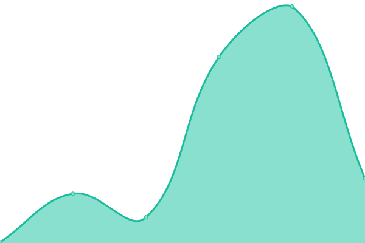
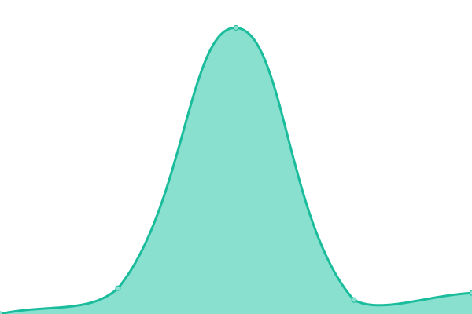

# [📈 Live Status](https://AodhanLP.github.io/upptime-status): <!--live status--> **🟩 All systems operational**

This repository contains the open-source uptime monitor and status page for [Aodhan Wade](https://AodhanLP.github.io/upptime-status), powered by [Upptime](https://github.com/upptime/upptime).

With [Upptime](https://upptime.js.org), you can get your own unlimited and free uptime monitor and status page, powered entirely by a GitHub repository. We use [Issues](https://github.com/AodhanLP/upptime-status/issues) as incident reports, [Actions](https://github.com/AodhanLP/upptime-status/actions) as uptime monitors, and [Pages](https://AodhanLP.github.io/upptime-status) for the status page.

<!--start: status pages-->
<!-- This summary is generated by Upptime (https://github.com/upptime/upptime) -->
<!-- Do not edit this manually, your changes will be overwritten -->
<!-- prettier-ignore -->
| URL | Status | History | Response Time | Uptime |
| --- | ------ | ------- | ------------- | ------ |
|  [Google](https://www.google.com) | 🟩 Up | [google.yml](https://github.com/AodhanLP/upptime-status/commits/HEAD/history/google.yml) | 

 68ms
     
 | 

<a href="https://AodhanLP.github.io/upptime-status/history/google">100.00%</a>
    

|  [Jenkins](https://status.jenkins.io/) | 🟩 Up | [jenkins.yml](https://github.com/AodhanLP/upptime-status/commits/HEAD/history/jenkins.yml) | 

 394ms
     
 | 

<a href="https://AodhanLP.github.io/upptime-status/history/jenkins">100.00%</a>
    

|  [Circle CI](https://status.circleci.com/) | 🟩 Up | [circle-ci.yml](https://github.com/AodhanLP/upptime-status/commits/HEAD/history/circle-ci.yml) | 

 229ms
     
 | 

<a href="https://AodhanLP.github.io/upptime-status/history/circle-ci">100.00%</a>
    

|  [AWS](https://health.aws.amazon.com/health/status) | 🟩 Up | [aws.yml](https://github.com/AodhanLP/upptime-status/commits/HEAD/history/aws.yml) | 

 338ms
     
 | 

<a href="https://AodhanLP.github.io/upptime-status/history/aws">100.00%</a>
    

|  [GitHub](https://www.githubstatus.com/) | 🟩 Up | [git-hub.yml](https://github.com/AodhanLP/upptime-status/commits/HEAD/history/git-hub.yml) | 

 195ms
     
 | 

<a href="https://AodhanLP.github.io/upptime-status/history/git-hub">100.00%</a>
    

|  [Atlassian](https://status.atlassian.com/) | 🟩 Up | [atlassian.yml](https://github.com/AodhanLP/upptime-status/commits/HEAD/history/atlassian.yml) | 

 243ms
     
 | 

<a href="https://AodhanLP.github.io/upptime-status/history/atlassian">100.00%</a>
    

|  [Slack](https://status.slack.com/) | 🟩 Up | [slack.yml](https://github.com/AodhanLP/upptime-status/commits/HEAD/history/slack.yml) | 

 125ms
     
 | 

<a href="https://AodhanLP.github.io/upptime-status/history/slack">100.00%</a>
    

|  [Google Stuff](https://www.google.com/appsstatus/dashboard/) | 🟩 Up | [google-stuff.yml](https://github.com/AodhanLP/upptime-status/commits/HEAD/history/google-stuff.yml) | 

 32ms
     
 | 

<a href="https://AodhanLP.github.io/upptime-status/history/google-stuff">100.00%</a>
    

|  [Sage](https://status.sage.com/) | 🟩 Up | [sage.yml](https://github.com/AodhanLP/upptime-status/commits/HEAD/history/sage.yml) | 

 2422ms
     
 | 

<a href="https://AodhanLP.github.io/upptime-status/history/sage">100.00%</a>
    

<!--end: status pages-->

[**Visit our status website →**](https://AodhanLP.github.io/upptime-status)

## 📄 License

- Powered by: [Upptime](https://github.com/upptime/upptime)
- Code: [MIT](./LICENSE) © [Aodhan Wade](https://AodhanLP.github.io/upptime-status)
- Data in the `./history` directory: [Open Database License](https://opendatacommons.org/licenses/odbl/1-0/)
