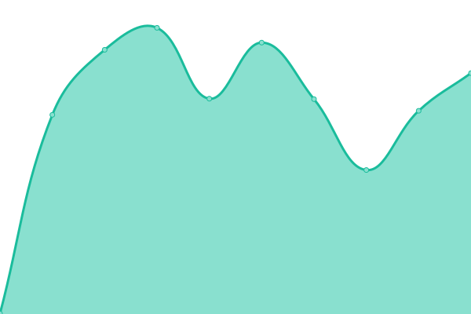
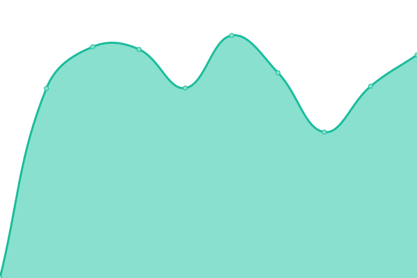
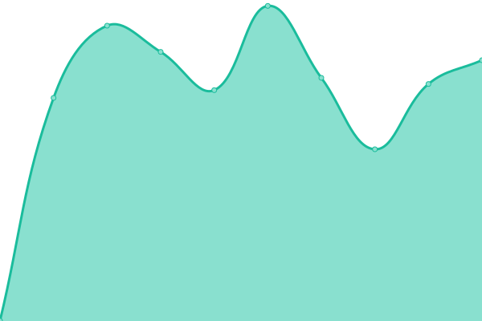
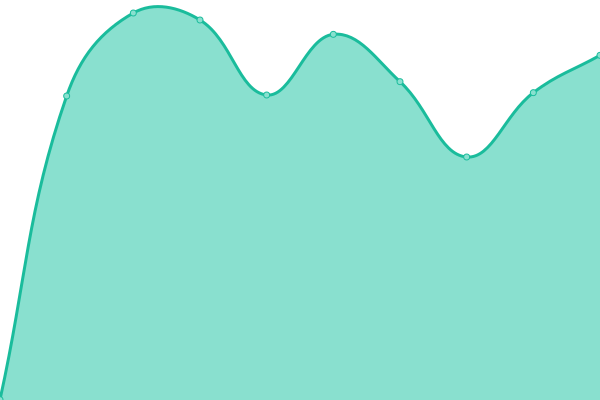
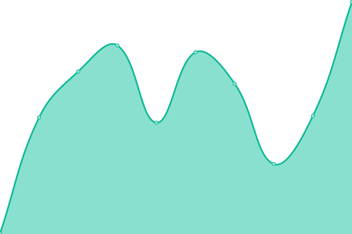
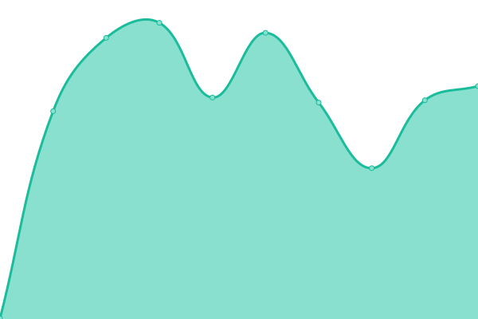
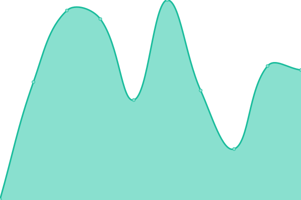

# [📈 Live Status](https://AodhanLP.github.io/upptime-status): <!--live status--> **🟩 All systems operational**

This repository contains the open-source uptime monitor and status page for [Aodhan Wade](https://AodhanLP.github.io/upptime-status), powered by [Upptime](https://github.com/upptime/upptime).

With [Upptime](https://upptime.js.org), you can get your own unlimited and free uptime monitor and status page, powered entirely by a GitHub repository. We use [Issues](https://github.com/AodhanLP/upptime-status/issues) as incident reports, [Actions](https://github.com/AodhanLP/upptime-status/actions) as uptime monitors, and [Pages](https://AodhanLP.github.io/upptime-status) for the status page.

<!--start: status pages-->
<!-- This summary is generated by Upptime (https://github.com/upptime/upptime) -->
<!-- Do not edit this manually, your changes will be overwritten -->
<!-- prettier-ignore -->
| URL | Status | History | Response Time | Uptime |
| --- | ------ | ------- | ------------- | ------ |
|  [Jenkins](https://jenkins.learningpool.com/login) | 🟩 Up | [jenkins.yml](https://github.com/AodhanLP/upptime-status/commits/HEAD/history/jenkins.yml) | 

 369ms
     
 | 

<a href="https://AodhanLP.github.io/upptime-status/history/jenkins">100.00%</a>
    

|  [dev](https://qa.curatrdev.com/) | 🟩 Up | [dev.yml](https://github.com/AodhanLP/upptime-status/commits/HEAD/history/dev.yml) | 

 792ms
     
 | 

<a href="https://AodhanLP.github.io/upptime-status/history/dev">100.00%</a>
    

|  [UAT](https://aodhanwade-uat.headstreamlxp.info/) | 🟩 Up | [uat.yml](https://github.com/AodhanLP/upptime-status/commits/HEAD/history/uat.yml) | 

 928ms
     
 | 

<a href="https://AodhanLP.github.io/upptime-status/history/uat">100.00%</a>
    

|  [prod](https://hal9001.curatr3.com/) | 🟩 Up | [prod.yml](https://github.com/AodhanLP/upptime-status/commits/HEAD/history/prod.yml) | 

 842ms
     
 | 

<a href="https://AodhanLP.github.io/upptime-status/history/prod">100.00%</a>
    

|  [Stream LXP](https://learningpool.streamlxp.com/) | 🟩 Up | [stream-lxp.yml](https://github.com/AodhanLP/upptime-status/commits/HEAD/history/stream-lxp.yml) | 

 870ms
     
 | 

<a href="https://AodhanLP.github.io/upptime-status/history/stream-lxp">100.00%</a>
    

|  [Stream LXP US](https://learningpool-us.streamlxp.com/) | 🟩 Up | [stream-lxp-us.yml](https://github.com/AodhanLP/upptime-status/commits/HEAD/history/stream-lxp-us.yml) | 

 345ms
     
 | 

<a href="https://AodhanLP.github.io/upptime-status/history/stream-lxp-us">100.00%</a>
    

|  [Learning Locker](https://saas.learninglocker.net/) | 🟩 Up | [learning-locker.yml](https://github.com/AodhanLP/upptime-status/commits/HEAD/history/learning-locker.yml) | 

 418ms
     
 | 

<a href="https://AodhanLP.github.io/upptime-status/history/learning-locker">100.00%</a>
    

|  [Learning Locker US](https://saas-us.learninglocker.net/) | 🟩 Up | [learning-locker-us.yml](https://github.com/AodhanLP/upptime-status/commits/HEAD/history/learning-locker-us.yml) | 

 164ms
     
 | 

<a href="https://AodhanLP.github.io/upptime-status/history/learning-locker-us">100.00%</a>
    

|  [Waves](https://waves.learningpool.com/) | 🟩 Up | [waves.yml](https://github.com/AodhanLP/upptime-status/commits/HEAD/history/waves.yml) | 

 490ms
     
 | 

<a href="https://AodhanLP.github.io/upptime-status/history/waves">100.00%</a>
    

<!--end: status pages-->

[**Visit our status website →**](https://AodhanLP.github.io/upptime-status)

## 📄 License

- Powered by: [Upptime](https://github.com/upptime/upptime)
- Code: [MIT](./LICENSE) © [Aodhan Wade](https://AodhanLP.github.io/upptime-status)
- Data in the `./history` directory: [Open Database License](https://opendatacommons.org/licenses/odbl/1-0/)
